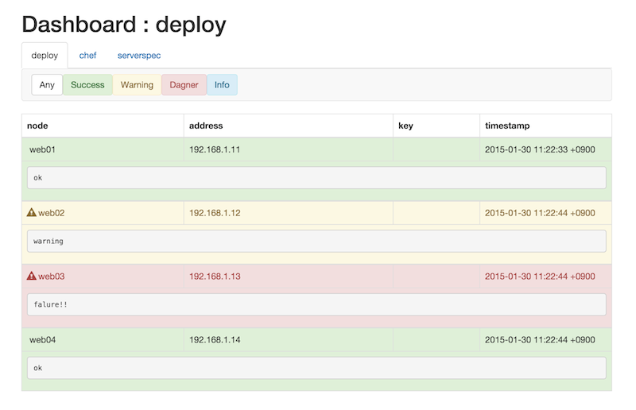

# consul-kv-dashboard

A dashboard web console based on Consul's key value store.



## Build

    $ make

## Usage

```
Usase of ./consul-kv-dashboard:
  -asset="": Serve files located in /assets from local directory. If not specified, use built-in asset.
  -namespace="dashboard": Consul kv top level key name. (/v1/kv/{namespace}/...)
  -port=3000: http listen port
  -trigger="": trigger command
  -v=false: show vesion
  -version=false: show vesion
```

## Quick start

1. Run consul cluster.
1. Run consul-kv-dashboard.
2. Access to `http://myhost.example.com:3000/`
3. Put a dashboard event to Consul KV.
```
$ curl -X PUT -d "content" localhost:8500/v1/kv/dashboard/example/myhost?flags=1422597159000
```

### Consul KV's key name specification

```
/v1/kv/{namespace}/{category}/{node}(/{key})?flags={flags}
```

* {namespace} : namespace. (default: `dashboard`)
* {category} : dashboard category (e.g. `chef`, `serverspec`, `deploy`...)
* {node} : consul node name. How to get a self node name using consul API, `curl -s localhost:8500/v1/agent/self | jq -r .Member.Name`
* {key} : sub event name's key. (optional)
* {flags} : timestamp(unix\_time) * 1000 + {status}
  * {status}
    * 0 : Success
    * 1 : Warning
    * 2 : Danger
    * 3 : Info

## Trigger

```
$ consul-kv-dashboard -trigger /path/to/command
```

Invoke trigger command when dashboard item's status was changed.

Pass a changed item (encoded as json) to command's stdin.

```json
{"category":"testing","node":"web01","address":"192.168.1.10","timestamp":"2015-01-21 11:22:33 +0900","status":"danger","key":"","data":"failure!!"}
```

## LICENSE

MIT
